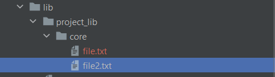

If you want to convert folders to .json file, for example

`
flutter pub run project_structure_generator:from_folders -root lib/ -output lib/output.json
`

`-root` - root dir

`-output` - output dir for .json file

If you want to convert json to folders, for example

`
flutter pub run project_structure_generator:to_folders -json lib/structure.json -output lib/
`

`-output` - output dir

`-json` - input json dir

